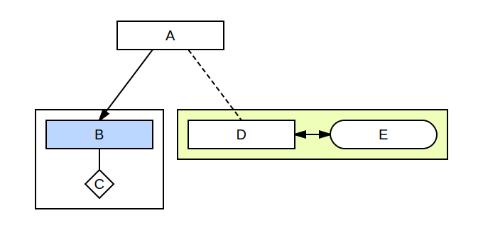
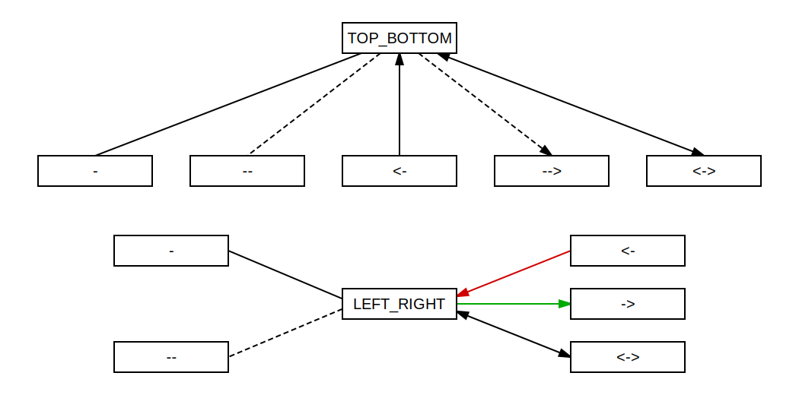
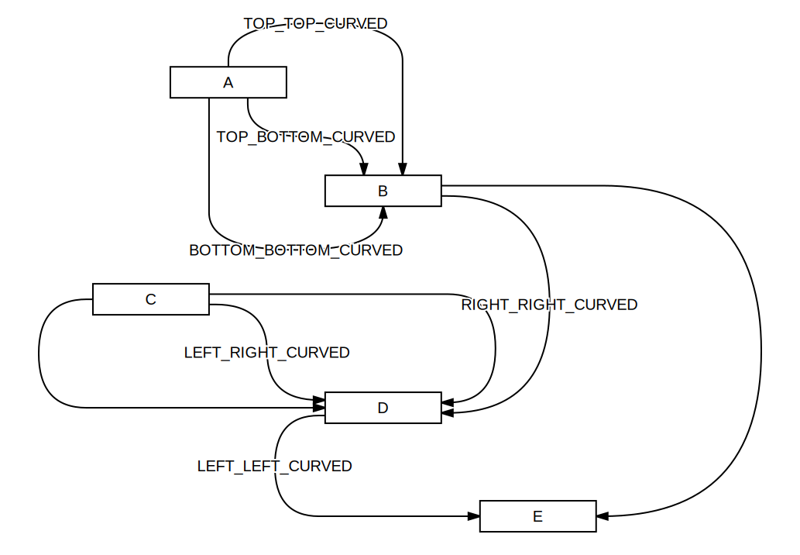
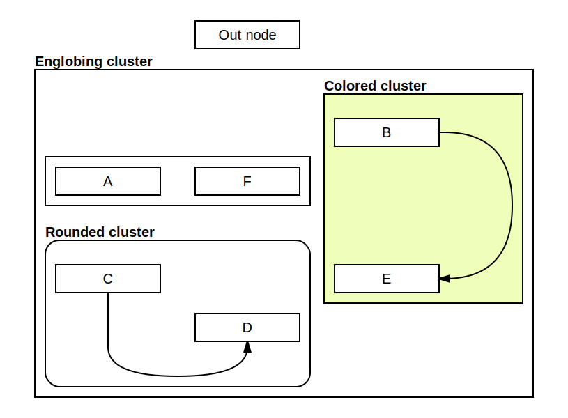

# svg_chart

Minimalist tool to draw simple charts.



This chart is made with the following code :

``` python
from svg_chart import *

chart = Chart()

a = Node(chart, 0.5, 0, "A")
b = Node(chart, 0, 2, "B", color="#bcd7ff")
c = Node(chart, 0, 3, "C", rounded=True)
d = Node(chart, 1, 2, "D")
e = Node(chart, 2, 2, "E")

Edge(chart, a, b, "->")
Edge(chart, b, c)
Edge(chart, a, d, "--")
Edge(chart, d, e, "<->")

Cluster(chart, [d, e], color="#efffb9")
Cluster(chart, [b, c])

chart.exportSvg("simple_demo.svg")
```

## Nodes

This tool does not provide a layout engine to place elements automatically.

Instead it relies on a fixed grid to manually specify where nodes must be placed.

The grid is a helper but nodes can be placed at fractionnal position.

Nodes have a few optional parameters to change their apparence.


## Edges

A few optionnal parameters allow to change edge layout and apparence.



``` python
tb = Node(chart, 2, 0, "VERTICAL")
lr = Node(chart, 2, 5, "HORIZONTAL")

for i, edge_string in enumerate(['-', '--', '<-', '-->', '<->']):
    Edge(chart, tb, Node(chart, i, 2.5, edge_string), edge_string)

Edge(chart, lr, Node(chart, 0.5, 4, "-"), "-", layout=EdgeLayout.HORIZONTAL)
Edge(chart, lr, Node(chart, 0.5, 6, "--"), "--", "dashed", layout=EdgeLayout.HORIZONTAL)
Edge(chart, lr, Node(chart, 3.5, 4, "<-"), "<-", "red", color="#d00000", layout=EdgeLayout.HORIZONTAL)
Edge(chart, lr, Node(chart, 3.5, 5, "->"), "->", color="#00aa00", layout=EdgeLayout.HORIZONTAL)
Edge(chart, lr, Node(chart, 3.5, 6, "<->"), "<->", layout=EdgeLayout.HORIZONTAL)
```

Edges are straight lines by default but it's possible to create curved edges by passing an `EdgeShape` to `Edge` class.

:warning: the current code tries to order edges correctly on node border but some cases with multiple curved edges on a single border are not managed properly.



``` python
a = Node(chart, 1.5, 8, "A")
b = Node(chart, 2.5, 10, "B")
c = Node(chart, 1, 12, "C")
d = Node(chart, 2.5, 14, "D")
e = Node(chart, 4, 16, "E")

# Vertical layout, curved edges :
Edge(chart, a, b, "->", "BEFORE", layout=EdgeLayout.VERTICAL, shape=EdgeShape.CURVE_BEFORE)
Edge(chart, a, b, "->", "BETWEEN", layout=EdgeLayout.VERTICAL, shape=EdgeShape.CURVE_BETWEEN)
Edge(chart, a, b, "->", "AFTER", layout=EdgeLayout.VERTICAL, shape=EdgeShape.CURVE_AFTER)

# Horizontal layout, curved edges :
Edge(chart, c, d, "->", "BEFORE", layout=EdgeLayout.HORIZONTAL, shape=EdgeShape.CURVE_BEFORE)
Edge(chart, c, d, "->", "BETWEEN", layout=EdgeLayout.HORIZONTAL, shape=EdgeShape.CURVE_BETWEEN)
Edge(chart, c, d, "->", "AFTER", layout=EdgeLayout.HORIZONTAL, shape=EdgeShape.CURVE_AFTER)
Edge(chart, b, d, "->", "AFTER", layout=EdgeLayout.HORIZONTAL, shape=EdgeShape.CURVE_AFTER)
Edge(chart, d, e, "->", "BETWEEN", layout=EdgeLayout.HORIZONTAL, shape=EdgeShape.CURVE_BETWEEN)
Edge(chart, b, e, "->", "AFTER", layout=EdgeLayout.HORIZONTAL, shape=EdgeShape.CURVE_AFTER)
```

## Clusters

Optional clusters can be created arround nodes, edges or other clusters.



``` python
o = Node(chart, 1, -2, "Out node")
a = Node(chart, 0, 1, "A")
b = Node(chart, 2, 0, "B")
c = Node(chart, 0, 3, "C")
d = Node(chart, 1, 4, "D")
e = Node(chart, 2, 3, "E")
f = Node(chart, 1, 1, "F")
cd = Edge(chart, c, d, "->", layout=EdgeLayout.VERTICAL, shape=EdgeShape.CURVE_AFTER)
be = Edge(chart, b, e, "->", layout=EdgeLayout.HORIZONTAL, shape=EdgeShape.CURVE_AFTER)

af = Cluster(chart, [a, f])
cd = Cluster(chart, [c, d, cd], "Rounded cluster", rounded=True)
be = Cluster(chart, [b, e, be], "Colored cluster", color="#efffb9")
Cluster(chart, [af, cd, be], "Englobing cluster")
```

## Credit

This simple tool is a simplification layer over [drawsvg](https://github.com/cduck/drawsvg) python library,
which is a good simplification layer over [SVG markup language](https://developer.mozilla.org/en-US/docs/Web/SVG).
