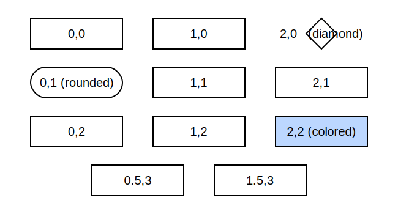

# svg_chart

Minimalist tool to draw simple charts.


This example chart is made with the following code :

``` python
chart = Chart(name="simple_demo")

a = chart.add(Node(0.5, 0, "A"))
b = chart.add(Node(0, 2, "B", color="#bcd7ff"))
c = chart.add(Node(0, 3, "C", rounded=True))
d = chart.add(Node(1, 2, "D"))
e = chart.add(Node(2, 2, "E"))

chart.add(Edge(a, b, "b0.4->t"))
chart.add(Edge(b, c, "b-t"))
chart.add(Edge(a, d, "b0.6--t"))
chart.add(Edge(d, e, "r<->l"))

chart.add(Cluster([b,c]))
chart.add(Cluster([d,e], color="#efffb9"))

chart.exportSvg("simple_demo.svg")
```

## Nodes

This tool does not provide a layout engine to place elements automatically.

Instead it relies on a fixed grid to manually specify where nodes must be placed.

Nodes have a few optional parameters to change their apparence.



## Edges

Similar to nodes, edges placement must be explicitly set at creation.

When creating an `Edge`, you :
- must define the origin and destination nodes
- must define the shape of the edge :
    - plain line : `-`
    - dashed line : `--`
    - arrow at origin : `<-`
    - arrow at destination : `->`
- must define the origin and destination node borders (left, right, top, bottom) with `l`, `r`, `t`, `b` characters.
- can define the relative position on the node border with a number between 0 and 1 after the border character.


## Cluster

Optional clusters can be created arround nodes.


## Credit

This simple tool is a simplification layer over [drawsvg](https://github.com/cduck/drawsvg) python library,
which is a good simplification layer over [SVG markup language](https://developer.mozilla.org/en-US/docs/Web/SVG).
